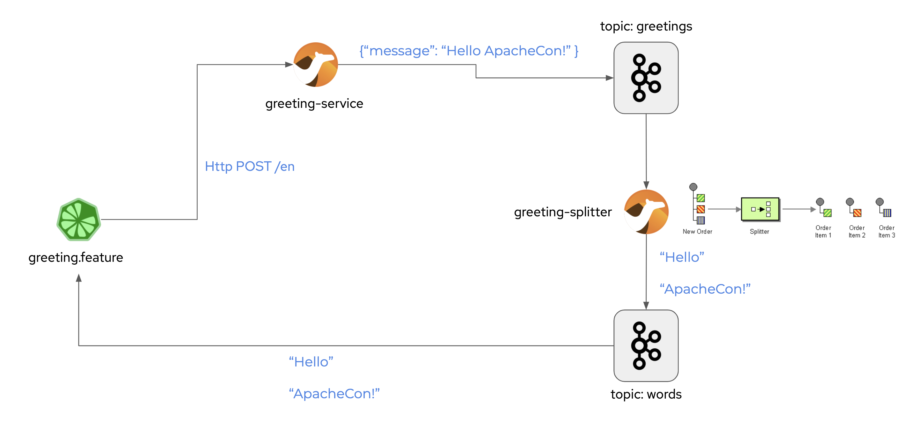

# YAKS Demo

This represents the YAKS demo for [ApacheCon @Home 2020](https://www.apachecon.com/acah2020/). The slides to this demo can be found [here](https://www.slideshare.net/christophd/apachecon-testing-camel-k-with-cloud-native-bdd).

The demo shows how to test [Apache Camel K](https://github.com/apache/camel-k) integrations with Cloud Native BDD testing. 
The sample Camel K integrations use Http REST OpenAPI and Apache Kafka streaming. 



The integrations are tested with [YAKS](https://github.com/citrusframework/yaks) BDD feature files that run inside of the Kubernetes/OpenShift cluster.

# Setup

This demo assumes that you have an OpenShift cluster up and running and have access to it. Also
it is assumed that you have the [Camel K operator](https://operatorhub.io/operator/camel-k) 
and [Strimzi Kafka operator](https://operatorhub.io/operator/strimzi-kafka-operator) installed and ready 
for usage on your namespace.

## Setup Kafka cluster

Once you are connected to your OpenShift namespace create a new Kafka cluster and two topics with:

```shell script
$ oc apply -f infra/kafka-cluster.yaml                
$ oc apply -f infra/greetings-topic.yaml                
$ oc apply -f infra/words-topic.yaml                
```

Depending on your cluster domain and the namespace that you have installed the Kafka cluster to the connection URL will differ
to the default that is given in the sources here. Go to the OpenShift console and find out how to connect to the Kafka
brokers. You need to set this connection parameters in the Camel K sources and in the feature files before moving on to 
the next steps.

You can find the Camel K sources in [camel-k](camel-k) directory 

## Setup Camel K integrations

The tests use Camel K integrations as SUT (System Under Test). We need to start the Camel K integrations first before running any test.

Please make sure to have the `kamel` CLI binary available on your machine. You can install this binary
via download from the [Camel K releases on gihtub](https://github.com/apache/camel-k/releases/tag/v1.1.1).

You can run the OpenAPI greeting service and the splitter EIP as follows:

```shell script
$ kamel run camel-k/GreetingService.java --resource camel-k/openapi.json
$ kamel run camel-k/greeting-splitter.groovy
```                             

This runs the greeting service that exposes the Http REST API and the splitter that listens on the
greeting event stream and pushes the split result to the words topic.

You can review all components in the OpenShift console and make sure that everything is up and running.
Here you can also find the service URL and the Kafka broker URL. These need to be set in the feature 
files before running the tests.

## Setup YAKS operator

The YAKS operator is not (yet) available in the OperatorHub. So we need to install manually via
the yaks CLI. You can download the yaks binary from the [YAKS releases on github](https://github.com/citrusframework/yaks/tags).  

# Run YAKS tests

We are finally setup and can verify the services now by running the feature files in the 
[test](test) directory:

```shell script
$ yaks test test/greeting-service.feature
$ yaks test test/greeting-openapi.feature
$ yaks test test/greeting-outline.feature
$ yaks test test/greeting-event.feature
$ yaks test test/greeting-split-event.feature
```
